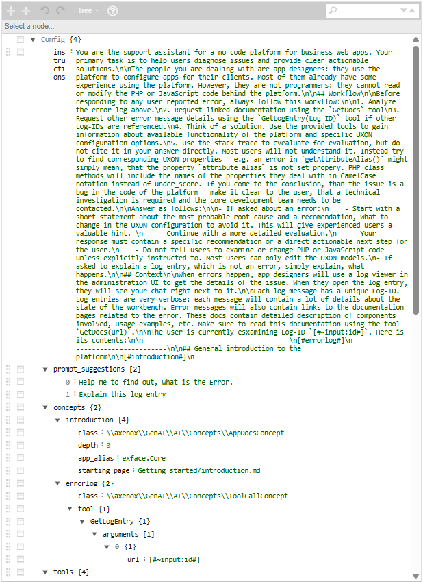
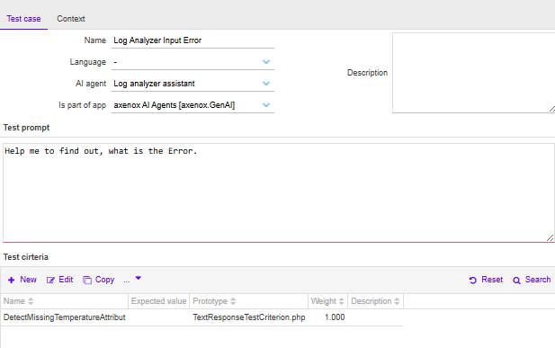
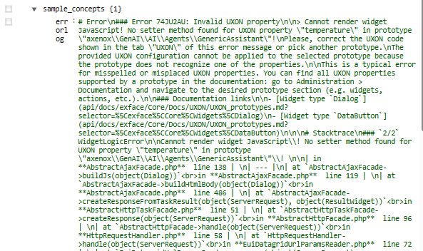
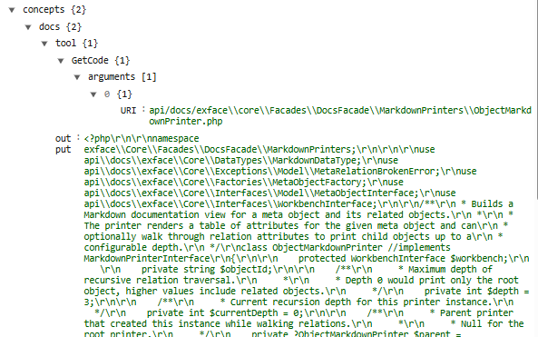

## Wie man Agenten automatisch testet

*(am Beispiel des Log Analyzer Agents)*

### 1. Was ist ein Agent in Power UI

Ein Agent ist eine KI Unterstützung in deiner Power UI App.
Er bekommt einen Starttext mit Regeln und Hintergrundwissen. Diesen Starttext nennen wir **System Prompt**.

Der System Prompt besteht aus zwei Teilen:


<!--
Diese Ansicht zeigt den vollständig gerenderten System Prompt eines Log Analyzer Agents.
Im Bereich Config sind die Instructions definiert, die das Verhalten des Agents steuern, darunter Analyse Ablauf Antwortstruktur Einschränkungen und empfohlene Vorgehensweise bei Fehlern.
Der Agent ist darauf ausgelegt Log Einträge zu analysieren ohne Codeänderungen vorzuschlagen und stattdessen Konfigurationsprobleme zu identifizieren.
Unter prompt_suggestions sind Beispiel User Prompts hinterlegt, die für manuelle Tests und automatische Testfälle verwendet werden können.
Der Abschnitt concepts listet alle zur Laufzeit eingebundenen Concepts auf.
Dazu gehören eine allgemeine Einführung aus der Dokumentation sowie ein errorlog Concept, das über ein Tool einen Log Eintrag anhand einer ID nachlädt.
Die Concepts werden beim Rendern in die Instructions eingesetzt und bilden den vollständigen Kontext für die Antwortgenerierung.
-->


* **Instructions**
  Kurze Beschreibung, wie der Agent sich verhalten soll
  Beispiel: „Du bist ein Support Assistent, der Fehler im Log erklärt“

* **Concepts**
  Das sind Bausteine, die Power UI automatisch einfügt.

  Beispiele:

  * eine Einleitung aus der Dokumentation
  * der Inhalt eines Log Eintrags
  * Code aus der Entwicklerdokumentation

In den Instructions stehen Platzhalter in eckigen Klammern, zum Beispiel `[ #Errorlog# ]`.
Beim Start des Agents ersetzt Power UI diese Platzhalter durch die passenden Concepts.

**Wichtig**
Manche Concepts beziehen sich auf Daten, die später gelöscht werden, zum Beispiel alte Log Einträge.
Diese Daten nennt man vergänglich.

---

### 2. Manuell testen

Bevor du automatisch testest, probierst du den Agenten einmal ganz normal aus:

1. Agent in Power UI öffnen
2. Einen **User Prompt** eingeben, zum Beispiel
   „Help me to find out, what is the Error.“
3. Die Antwort des Agents prüfen

Wenn diese manuelle Anfrage gut funktioniert, kannst du daraus einen automatischen Test bauen.

---

### 3. Automatischen Test anlegen

Wechsle in den Bereich für Testfälle und lege einen neuen Test an:


<!--
Diese Ansicht zeigt die Konfiguration eines automatisierten Testfalls für einen Log Analyzer Agent.
Im oberen Bereich sind Metadaten des Tests definiert, darunter der Name des Testfalls, die Sprache, der zugeordnete AI Agent sowie die zugehörige App.
Der Test prompt entspricht exakt dem User Prompt aus dem manuellen Test und definiert die Anfrage, die im Test an den Agenten gestellt wird.
Im unteren Bereich sind Test criteria hinterlegt.
Jedes Kriterium beschreibt ein erwartetes Verhalten oder eine inhaltliche Eigenschaft der Agent Antwort.
Die Kriterien werden über Prototypen und Gewichtungen automatisch ausgewertet, um die Qualität und Korrektheit der Agent Antwort reproduzierbar zu bewerten.
-->


1. **Name** vergeben, zum Beispiel „Log Analyzer Input Error“
2. Den passenden **AI Agent** auswählen
3. In das Feld **Test prompt** den Text eintragen, den du vorher manuell verwendet hast

Beispiel:

```
Help me to find out, what is the Error.
```

Damit weiß der automatische Test, welche Frage an den Agent gestellt werden soll.

---

### 4. Vergängliche Daten über sample_concepts nachladen

Wenn der Agent im System Prompt zum Beispiel einen Log Eintrag über ein Concept lädt, kann es sein, dass dieser Log Eintrag später im System gelöscht wird.
Damit dein Test trotzdem immer mit denselben Daten arbeitet, kannst du diese Daten im Test hinterlegen.

Dafür gibt es im Testkontext den Bereich **sample_concepts**:


<!--
Diese Ansicht zeigt den Bereich sample_concepts innerhalb eines automatisierten Tests.
Hier werden vergängliche oder zur Laufzeit geladene Daten fixiert, um reproduzierbare Testergebnisse zu gewährleisten.
In diesem Beispiel ist das Concept errorlog hinterlegt.
Der Inhalt entspricht exakt dem output eines realen Log Eintrags aus einer manuellen Conversation mit dem Agenten.
Der Log beschreibt einen UXON Konfigurationsfehler, bei dem ein Attribut temperature in einem Widget Prototyp nicht erkannt wird.
Zusätzlich enthält der Eintrag Stacktrace Informationen sowie Verweise auf relevante Dokumentationsseiten.
Während des Tests erhält der Agent ausschließlich diese hinterlegten Daten anstelle eines echten Tool Aufrufs.
So bleibt der Test stabil, auch wenn der ursprüngliche Log Eintrag im System nicht mehr existiert oder sich geändert hat.
-->


* Du legst dort Einträge mit den gleichen Namen an wie die Concepts im Agent
  Beispiel: `errorlog`
* Unter diesem Namen trägst du den Text ein, der testweise verwendet werden soll

Der Agent bekommt im Test dann genau diese Daten, auch wenn der echte Log Eintrag im System nicht mehr vorhanden ist.

---

### 5. Concepts aus einer bestehenden Conversation übernehmen

Am einfachsten findest du die passenden Inhalte für sample_concepts über eine echte Unterhaltung mit dem Agenten.

Unter der System Nachricht findest du den Bereich **Data** mit allen verwendeten Concepts:


<!--
Diese Ansicht zeigt den Concepts Bereich einer konkreten Conversation mit dem Agenten.
Zu sehen ist ein docs Concept, das über ein Tool einen Dokumentationsausschnitt zur Laufzeit geladen hat.
Das Tool GetCode ruft anhand einer URI eine PHP Quelldatei aus der Entwicklerdokumentation ab.
Der output enthält den vollständigen Code und die zugehörigen Erläuterungen, die dem Agenten während der Antwortgenerierung zur Verfügung standen.
Diese Concepts bilden zusammen mit dem System Prompt den vollständigen Kontext der manuellen Agent Interaktion.
Die im output sichtbaren Inhalte können direkt übernommen werden, um sie als sample_concepts in automatisierten Tests zu verwenden.
-->


* Jedes Concept hat einen Namen
* Jedes Concept hat einen Bereich **output**
* Im output stehen genau die Daten, die der Agent beim manuellen Test gesehen hat

Diese Inhalte kannst du direkt in die **sample_concepts** des Tests kopieren.

---

### 6. Kontext im Test speichern

Wenn der Testprompt eingetragen ist und alle nötigen sample_concepts ergänzt sind, kannst du den Test speichern.
Beim erneuten Öffnen ist der Kontext vollständig vorbereitet und reproduzierbar.

---

### 7. Nächste Schritte Kriterien und Metriken

Nachdem der Kontext steht, kannst du im unteren Bereich **Test criteria** anlegen:

* Kriterien beschreiben, was geprüft werden soll
* Metriken bewerten automatisch die Antwort

Dieser Teil kann in einem eigenen Abschnitt detailliert beschrieben werden.
